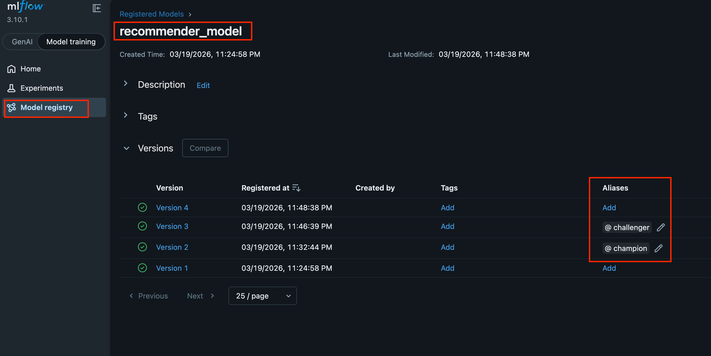

# Recommender System Deployment Guide

This project is part of AUEB's MSc in Data Science post grad course. It uses a microservices architecture managed by
Docker to handle model
training, API serving, and a user interface, in the wider context of recommender systems.

## Recommended workflow

Run the following command to start all services:

```bash 
docker compose up --build -d
```

Inside the `recommender-trainer` container, run the command (see below how to run commands inside a container):

```bash 
docker exec -it <CONTAINER ID> uv run src/main.py
```

The more runs you test (by changing the configuration under `src/recommender_app/utils/variables.py`) the more model
versions you will generate. I would suggest to at least have two versions.

One the model has been trained and registered to mlflow, you can assign a `champion` alias to one of the
models. **The alias should be assigned to Version 2 and above**. This can be achieved through the registry by clicking
on 'recommender_model' and adding the alias, as follows:


The fastAPI service, will try to load the `latest` model every 60 seconds. This means that after training your models,
you can just wait for the service to fetch the latest version. However, you could also use the `/api/v1/switch-model`
endpoint to manually force the change. If you used an alias for one of the models, you can also use that (e.g.
challenger).

After the trained models have been loaded, all services should work as expected.

## 🏗️ Service Architecture

The application is built as a set of interconnected microservices that manage the entire machine learning lifecycle.

* The **recommender-trainer** acts as the development hub, where data is processed and models are trained using Jupyter
  Lab.
* All training metrics and serialized model files are logged to the **mlflow** server, which serves as a centralized
  model registry.
* The **recommender-api** fetches the latest production-ready models to provide a RESTful FastAPI backend for
  making predictions or generate restaurants.
* Finally, the **recommender-ui** provides a Streamlit-based interface that communicates with the API
  to display dashboards and allow users to interact with the recommendation engine in real-time or via batch processing.
  The data, to run the predictors, can be found under `./data/processed/test.parquet` once the models have been trained.

## 🚀 Running the Application Services

To start the entire ecosystem, ensure you are in the project root and run:

```bash
docker compose up --build
```

Once the containers are running, you can access the different services at the following URLs:

| Service             |                       Description                        |                    URL |
|---------------------|:--------------------------------------------------------:|-----------------------:|
| **User Interface**  |   Streamlit dashboard for predictions and monitoring.    |  http://localhost:8501 |
| **FastAPI**         |      REST API for real-time and batch predictions.       |  http://localhost:8081 |
| **MLflow Server**   |   Tracking server for experiments and model registry.    |  http://localhost:5000 |
| **Trainer/Jupyter** | Environment for model training and notebook development. | http://localhost:8989* |

*you should check the docker logs in order to access jupyter & get the token link.

You can attach to each container using the `<CONTAINER ID>` and the command:

```bash
docker exec -it `<CONTAINER ID>` /bin/bash
```

## Running the code

Run:

```bash
docker ps
```

in order to find the `<CONTAINER ID>` which corresponds to the `<IMAGE>` named `recommender_aueb-recommender-trainer`.

Once you have the id run the following command to train a model and register it to mlflow:

```bash
docker exec -it <CONTAINER ID> uv run src/main.py
```

## Input Arguments

One CLI input argument has been defined, which will skip training, provided the models have been trained and logged to
mlflow.

The argument is `--skip-training` and can be used as follows (if attached to the container):

```
uv run src/main.py --skip-training
```

## 🛠️ Development Environment

If you need to access the project configuration, manage dependencies in `pyproject.toml`, or perform manual development
tasks, use the dedicated development container.

1. **Start the Dev Container**<br>
   The dev container is configured to stay active indefinitely without running a specific application, allowing you to "
   attach" to it.
    ```Bash
   docker compose -f docker-compose-dev.yml up -d --build
   ```

2. **Access the Environment**<br>
   To enter the container and interact with the filesystem (including `pyproject.toml`):
   ```Bash
   docker exec -it <CONTAINER ID> /bin/bash
   ```

3. **Managing Dependencies**<br>
   Inside the dev container, you can use `uv` to manage the project dependencies and create the
   `pyproject.toml` and `uv.lock` files:
    * Initialise projects:
      ```bash
      uv init
      ```
    * Add prod dependencies:
      ```bash
      uv add "ipython==8.20.0" "numpy==1.26.4" "pandas==2.1.4" "scikit-learn==1.2.2" "catboost==1.2" "mlflow==3.10.1"
      ```
    * Add dev dependencies:
      ```bash
      uv add --dev "pipreqs" "isort>=7.0.0" "jupyterlab>=4.5.0" "jupyterlab-code-formatter>=3.0.2" "jupyterlab-rise>=0.43.1" "black>=25.11.0"
      ```
    * You can start jupyter lab from the container, now that everything is installed, to test your code. You won't be
      able to run `main.py` from this dev container as you'll need mlflow running.
      ```bash
      uv run jupyter lab --ip 0.0.0.0  --port 8989 --no-browser --allow-root
      ```
    * Once the two files have been created and finalised, you can copy them from the container to your local directory
      using:
     ```
     docker cp <CONTAINER ID>:/app/pyproject.toml .
     docker cp <CONTAINER ID>:/app/uv.lock .
     ```

These files can then be used to build the production containers.

## 📂 Project Best Practices

* **Clean Code**: Follow `PEP 8` standards for Python styling.
* **Type Hints**: Always use type hints to ensure code clarity and reduce bugs in complex logic.
* **Docstrings**: Use proper documentation for functions to explain parameters and return types clearly.
* **Folder Structure**: Maintain code within the `./src` directory, separated by functional modules like
  `recommender_app`, `ml`, and `preprocessing`.